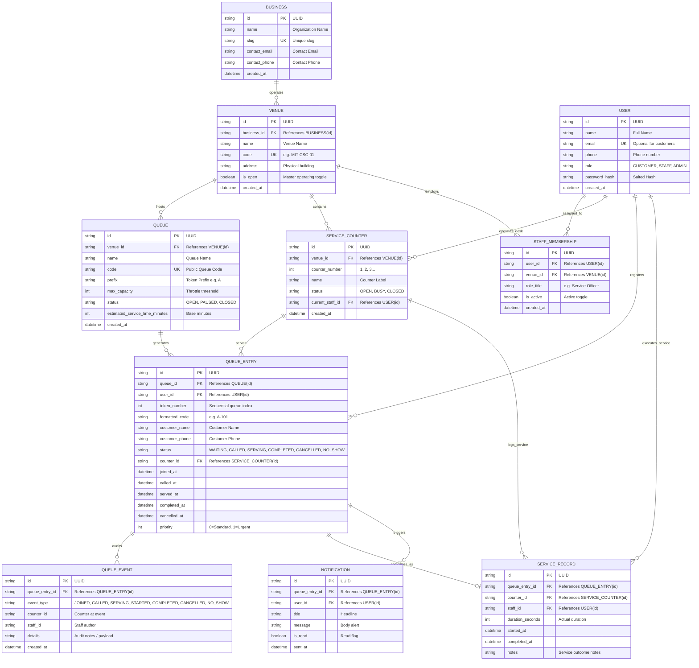

# MEENTO - Entity-Relationship Diagram

```mermaid
erDiagram
    BUSINESS ||--o{ VENUE : operates
    VENUE ||--o{ QUEUE : hosts
    VENUE ||--o{ SERVICE_COUNTER : contains
    VENUE ||--o{ STAFF_MEMBERSHIP : employs
    USER ||--o{ STAFF_MEMBERSHIP : assigned_to
    USER ||--o{ SERVICE_COUNTER : operates_desk
    USER ||--o{ QUEUE_ENTRY : registers
    QUEUE ||--o{ QUEUE_ENTRY : generates
    SERVICE_COUNTER ||--o{ QUEUE_ENTRY : serves
    QUEUE_ENTRY ||--o{ QUEUE_EVENT : audits
    QUEUE_ENTRY ||--o| SERVICE_RECORD : completes_as
    SERVICE_COUNTER ||--o{ SERVICE_RECORD : logs_service
    USER ||--o{ SERVICE_RECORD : executes_service
    QUEUE_ENTRY ||--o{ NOTIFICATION : triggers

    BUSINESS {
        string id PK "UUID"
        string name "Organization Name"
        string slug UK "Unique slug"
        string contact_email "Contact Email"
        string contact_phone "Contact Phone"
        datetime created_at
    }

    VENUE {
        string id PK "UUID"
        string business_id FK "References BUSINESS(id)"
        string name "Venue Name"
        string code UK "e.g. MIT-CSC-01"
        string address "Physical building"
        boolean is_open "Master operating toggle"
        datetime created_at
    }

    QUEUE {
        string id PK "UUID"
        string venue_id FK "References VENUE(id)"
        string name "Queue Name"
        string code UK "Public Queue Code"
        string prefix "Token Prefix e.g. A"
        int max_capacity "Throttle threshold"
        string status "OPEN, PAUSED, CLOSED"
        int estimated_service_time_minutes "Base minutes"
        datetime created_at
    }

    SERVICE_COUNTER {
        string id PK "UUID"
        string venue_id FK "References VENUE(id)"
        int counter_number "1, 2, 3..."
        string name "Counter Label"
        string status "OPEN, BUSY, CLOSED"
        string current_staff_id FK "References USER(id)"
        datetime created_at
    }

    USER {
        string id PK "UUID"
        string name "Full Name"
        string email UK "Optional for customers"
        string phone "Phone number"
        string role "CUSTOMER, STAFF, ADMIN"
        string password_hash "Salted Hash"
        datetime created_at
    }

    STAFF_MEMBERSHIP {
        string id PK "UUID"
        string user_id FK "References USER(id)"
        string venue_id FK "References VENUE(id)"
        string role_title "e.g. Service Officer"
        boolean is_active "Active toggle"
        datetime created_at
    }

    QUEUE_ENTRY {
        string id PK "UUID"
        string queue_id FK "References QUEUE(id)"
        string user_id FK "References USER(id)"
        int token_number "Sequential queue index"
        string formatted_code "e.g. A-101"
        string customer_name "Customer Name"
        string customer_phone "Customer Phone"
        string status "WAITING, CALLED, SERVING, COMPLETED, CANCELLED, NO_SHOW"
        string counter_id FK "References SERVICE_COUNTER(id)"
        datetime joined_at
        datetime called_at
        datetime served_at
        datetime completed_at
        datetime cancelled_at
        int priority "0=Standard, 1=Urgent"
    }

    QUEUE_EVENT {
        string id PK "UUID"
        string queue_entry_id FK "References QUEUE_ENTRY(id)"
        string event_type "JOINED, CALLED, SERVING_STARTED, COMPLETED, CANCELLED, NO_SHOW"
        string counter_id "Counter at event"
        string staff_id "Staff author"
        string details "Audit notes / payload"
        datetime created_at
    }

    SERVICE_RECORD {
        string id PK "UUID"
        string queue_entry_id FK "References QUEUE_ENTRY(id)"
        string counter_id FK "References SERVICE_COUNTER(id)"
        string staff_id FK "References USER(id)"
        int duration_seconds "Actual duration"
        datetime started_at
        datetime completed_at
        string notes "Service outcome notes"
    }

    NOTIFICATION {
        string id PK "UUID"
        string queue_entry_id FK "References QUEUE_ENTRY(id)"
        string user_id FK "References USER(id)"
        string title "Headline"
        string message "Body alert"
        boolean is_read "Read flag"
        datetime sent_at
    }
```
